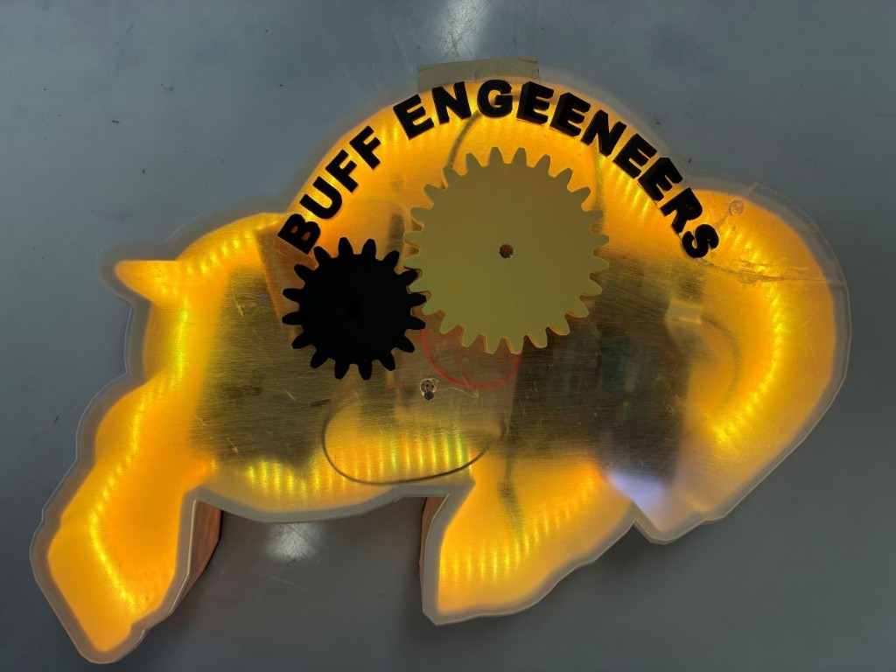
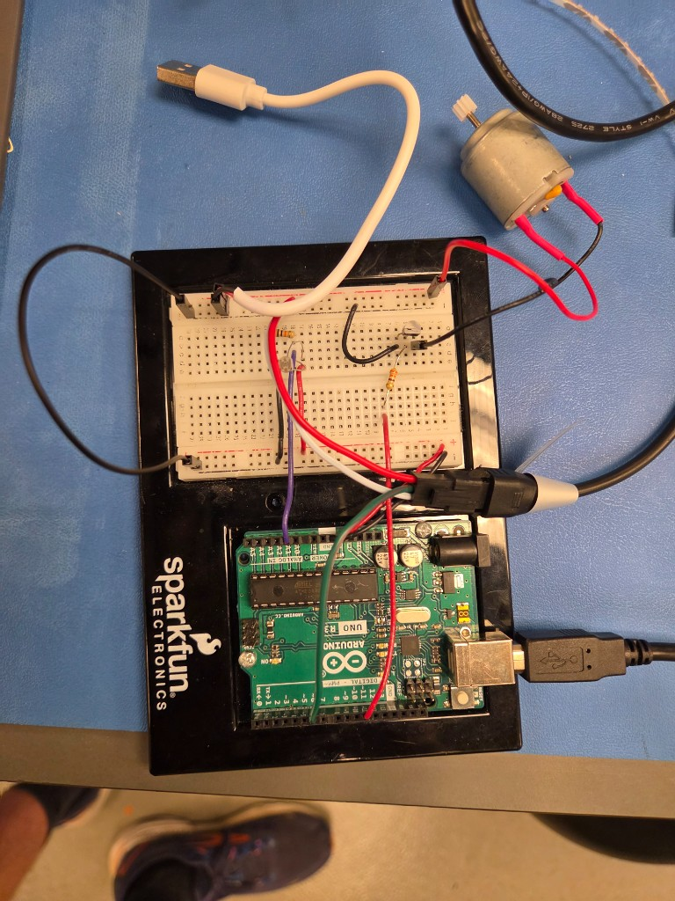

# GEEN1400-BuffaloIntroProject

This is Arduino/C++ code for a buffalo sculpture that reacts to light.

GEEN 1400 team: Scott, Connor, Griffin, Emilio, and Marcus. Arduino code by Scott and Emilio.

## Quickstart
Wire the Arduino, upload ArduinoBlink.ino, cover photoreceptor to activate.

### Demo
<video src="demo.mp4" controls width="100%" title="Buffalo sculpture running">
  <a href="demo.mp4">Watch the buffalo demo</a>
</video>

### What You Need
- ArduinoUno
- NeoPixel LEDs (current code is set up for 160 but can be changed through NUM_LEDS)
- DC Motor on a PWM pin
- Photoreceptor
- Adafruit NeoPixel library
- External battery pack attached to breadboard

### Wiring Table
| Part | Pin |
| --- | --- |
| Photoreceptor | A1 |
| NeoPixels | 6 |
| Motor PWM | 11 |

### Upload Steps
1. Install Arduino IDE
2. Sketch --> Include Library --> Manage Libraries --> Adafruit NeoPixel
3. Open ArduinoBlink.ino
4. Select your board and port
5. Upload

### Run It
1. Open Serial Monitor at 9600 (Prints light values from photoreceptor)
2. Cover the photoreceptor until the value drops below "lightValue", predefined as 700 (you don't need to keep it covered)
3. LEDs cascade gold, motor ramps up, last LED blinks red 5 times
4. Uncover the sensor after it finishes so it can trigger again 

### If it Doesn't Work
1. If it doesn't turn on at all check that the photoreceptor is printing values. If they are printing values, but aren't reaching below lightValue; check the sensor or adjust lightValue as needed.
2. If the photoreceptor isn't printing values; make sure it is correctly positioned on the breadboard and that the legs aren't touching.
3. If the photoreceptor IS printing values, but the lights and motor still don't turn on; make sure your power supply has sufficient current for all the LEDs and the motor
4. If the motor doesn't turn on but the lights do you may need to increase the initial voltage on the motor so it doesn't stall. This can be done by increasing motorMinSpeed.
